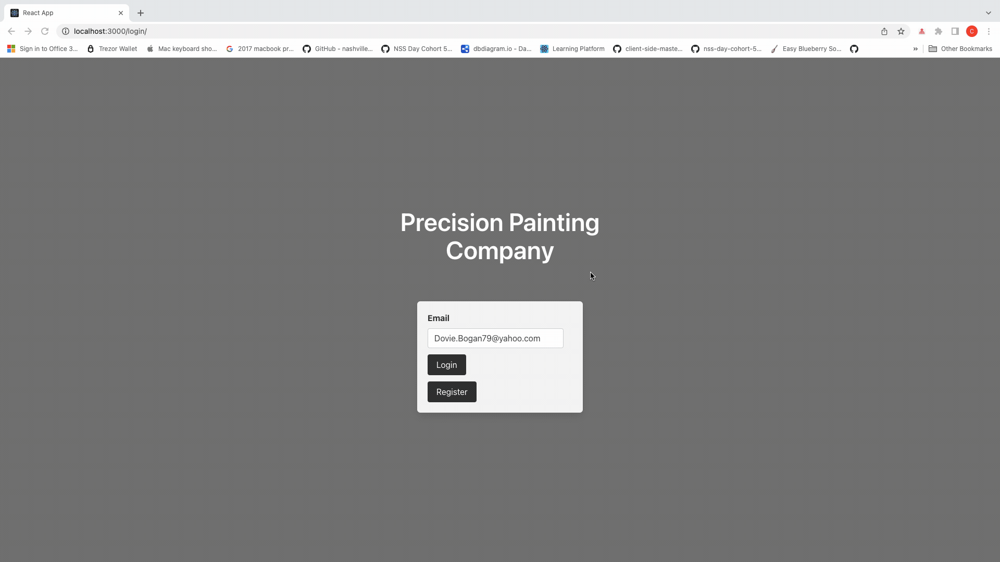
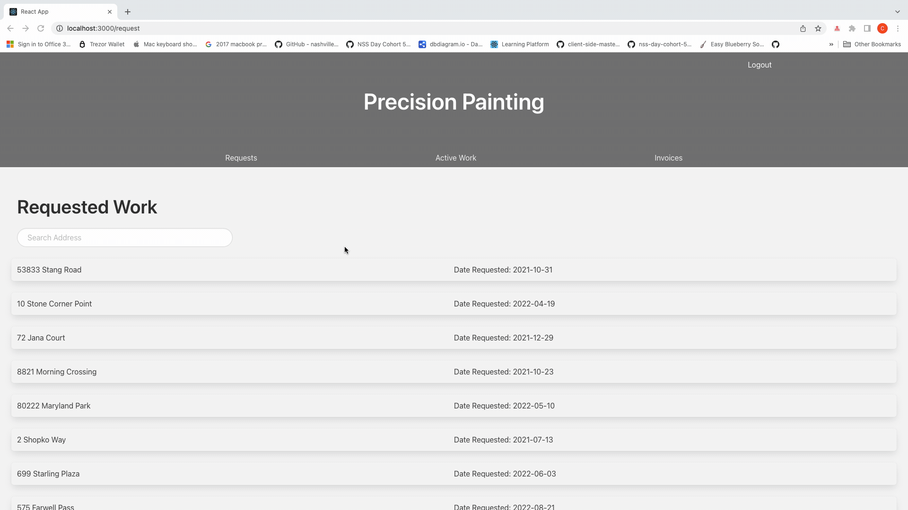
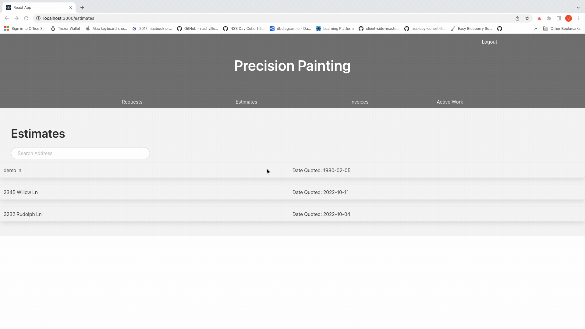
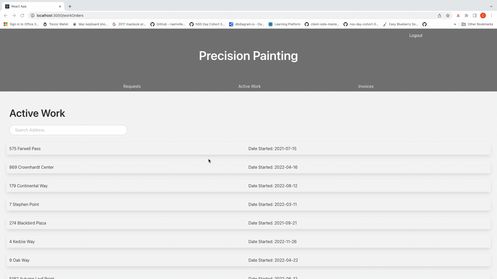
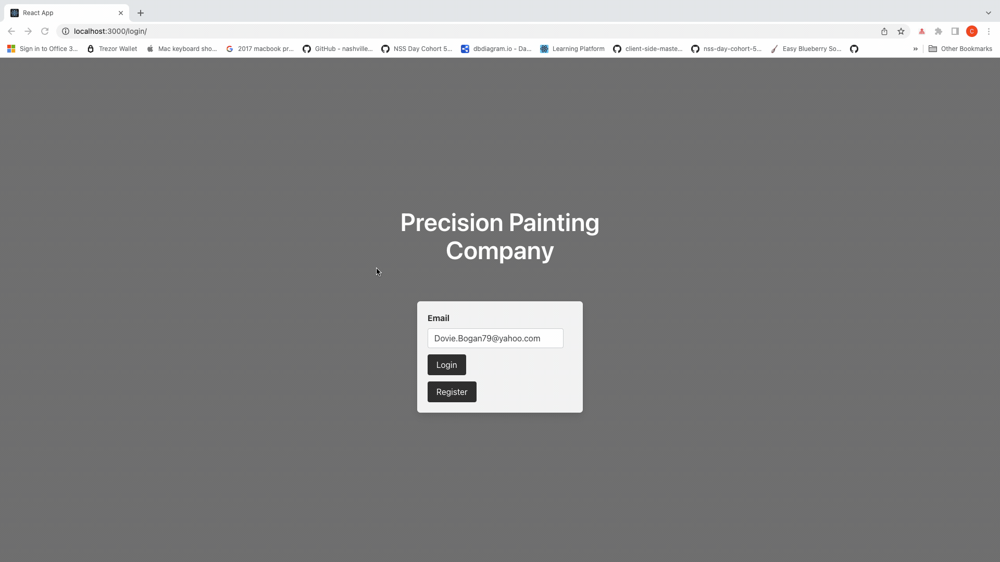

# Precision Painting APP
## Application Overview
This application was inspired by the paint company I owned before transitioning into spftware. The goal was to create an application where one user ,could create work orders, approve estimates and complete invoices for a paint company. In conjuncture the paint company application view allows the user to accept work orders, and create corresponding estimates and invoices. 

I built this application in two weeks initially, using React Hooks and Bulma for styling. My goals were to incorporate full CRUD functionality with many-to-many relationships, gain a deeper understanding of React Hooks, props, and state, while also incorporating a simple, functional user interface.

## Tech Used
React HTML CSS Bulma

## Intallation Instructions

1. In the terminal, run `git clone git@github.com:Connor-Lopshire/Precision-Painting.git`
2. Move into the folder you just created cd Precision-Painting
3. Run `npm install`
4. Run `npm start`
5. This will bring up a browser window showing the react app, but you won't be able to log into the site or access data without running the database side of this project. To download and start the server, go to `https://github.com/Connor-Lopshire/Precision-Painting-API`, and follow the readme there.

## User Experience

### Customer submits work order 

### Company accepts request and creates estimate 

### Customer approvres estimate

### Company marks work order complete and creates invoice

### Customer marks invoice complete

